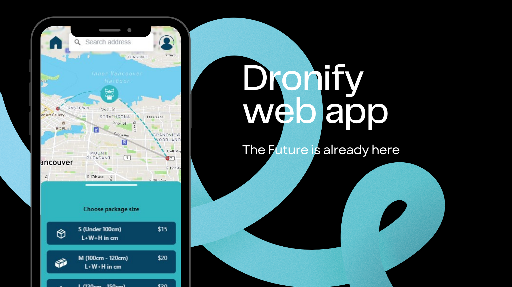
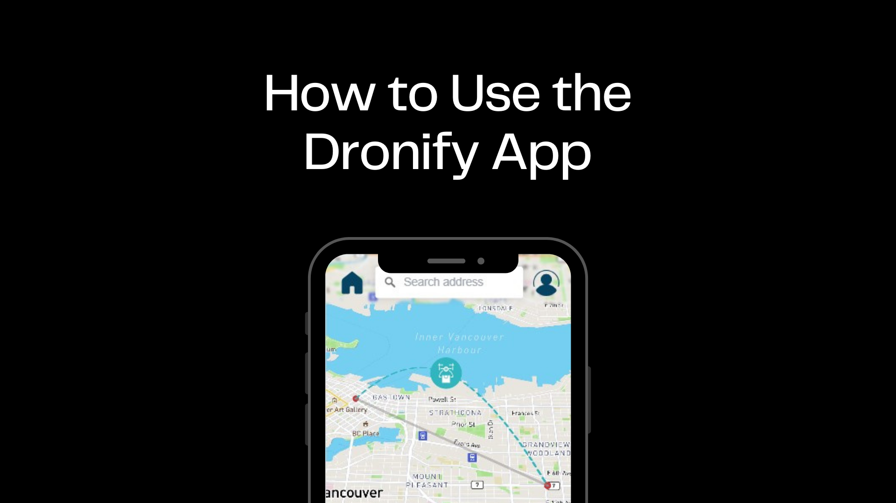
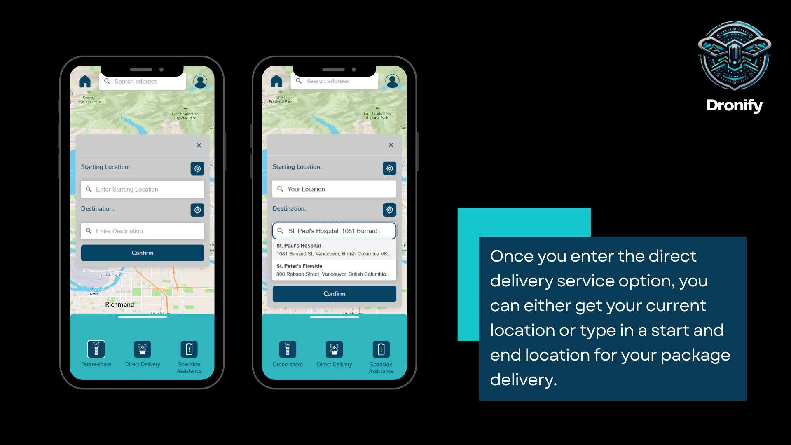
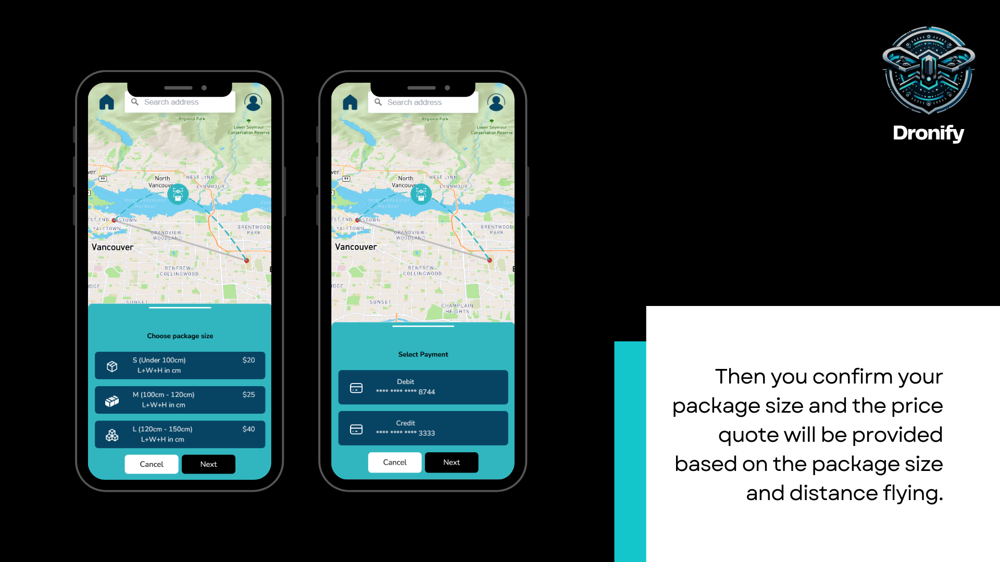
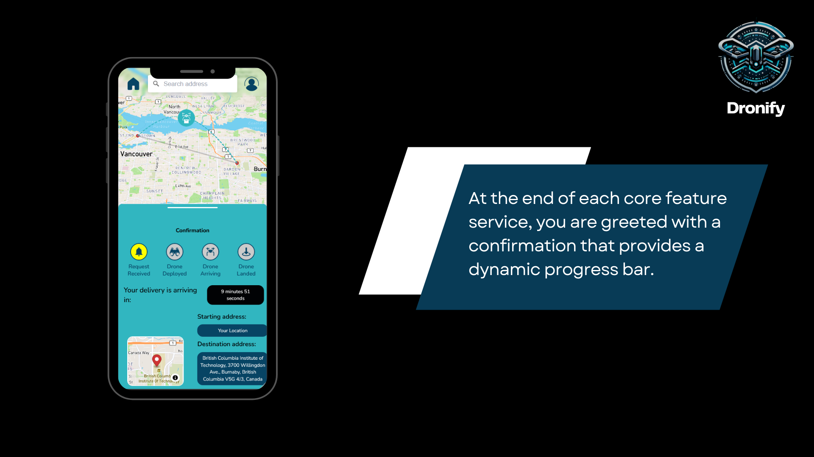
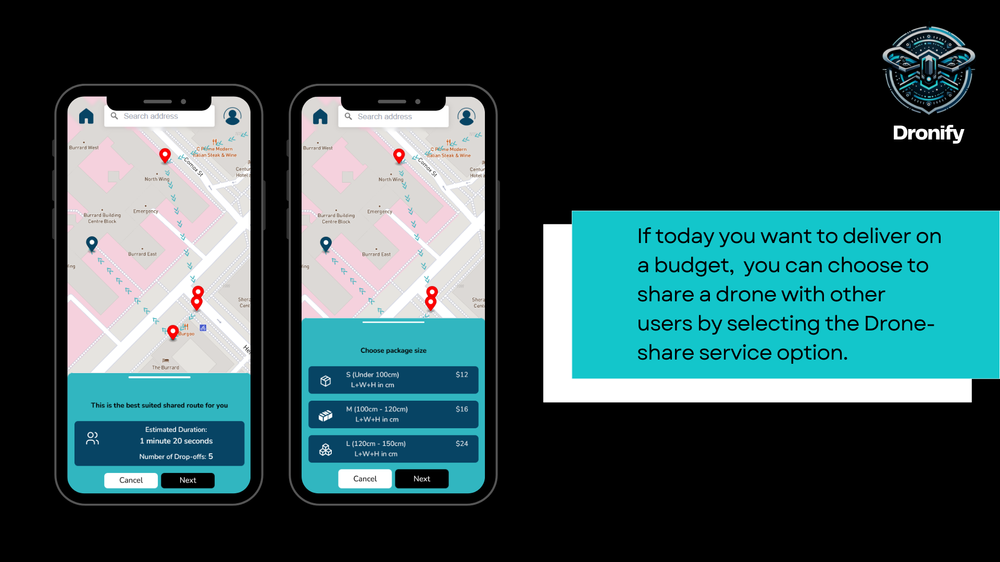
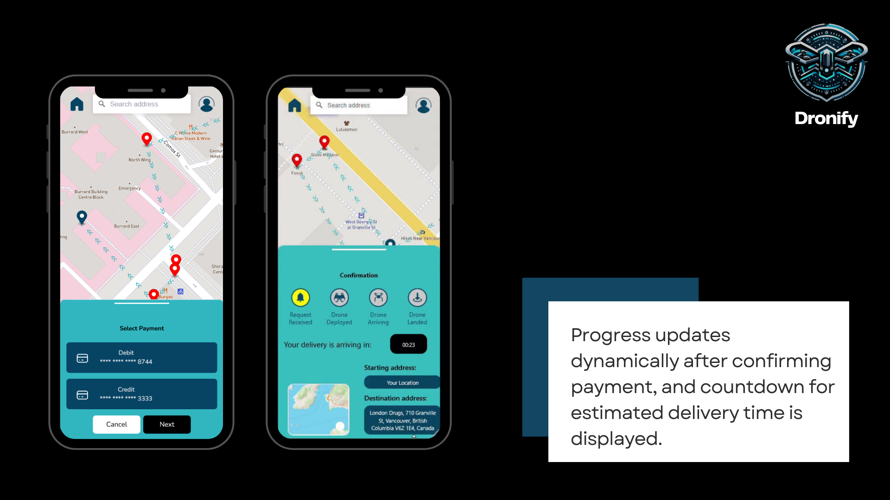
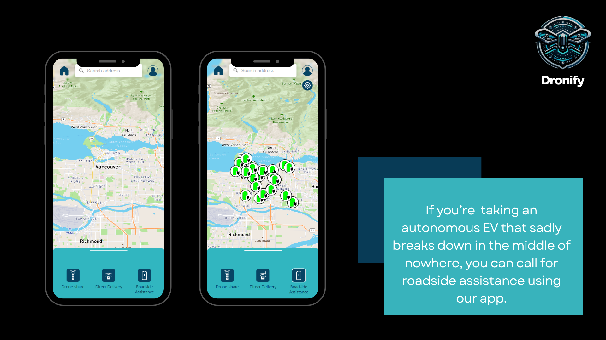
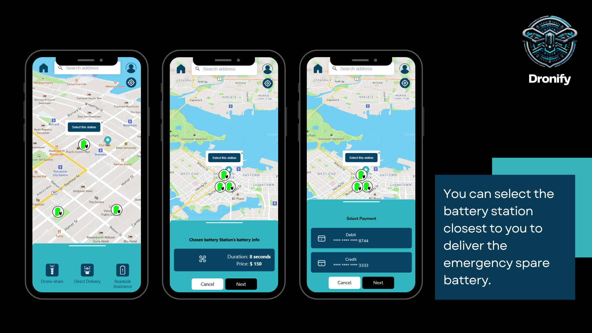
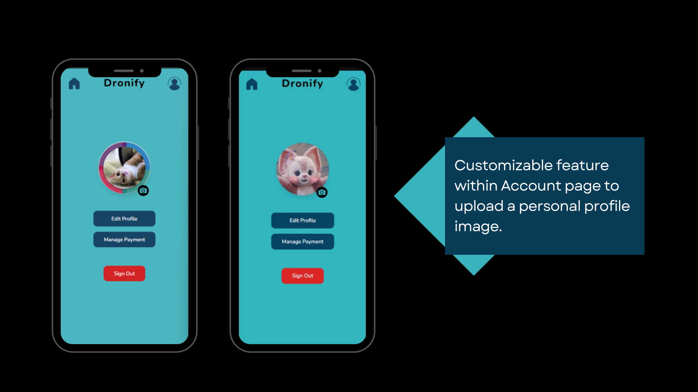

# Dronify


**Team Members:**

- Candice Wei
- Spring Cheng
- Nolan Wai
- Melissa Shao
- Michael Lau

## Project Description

**Dronify** is a web application that deploys autonomous drones (on-demand) to offer package delivery and roadside assistance for autonomous car owners during accidents, thereby reducing delivery time and traffic congestion.

## Project Technologies
### Front-End
* HTML, CSS 
* Tailwind
* Express.js
* EJS
* AJAX

### UI Component Library
* Flowbite
* **Cloudinary** for populating user’s profile image

### Back-End
* JavaScript
* jQuery
* **Turf.js** for routing display on the map
* **MongoDB** for hosting our data collection (user’s personal information, user’s session, battery station geo-coordinates)

### API
* **Mapbox API** for the map interface and the foundation for the visual interface
* **Geolocation API** for getting the user’s current location
* **Open Weather API** for our Easter egg

## List of Files
```

 Top level of project folder: 
├── .gitignore                          # Git ignore file
├── .env                                # env file
├── package-lock.json                   # package-lock.json file
├── package.json                        # package.json file                        
├── server.js                           # server.js file
├── users.js                            # users.js file
├── battery_station.js                  # battery_station.js file
├── tailwind.config.js                  # tailwind.config.js file
└── README.md

It has the following subfolders and files:
├── .git                                # Folder for git repo
├── node_modules/                       # node_modules file
├── .vscode/                            # .vscode file
├── public/                             # Folder for all static files
    └── images/
        ├── battery_marker.svg
        ├── catmeme.png
        ├── chevrons-right.png
        ├── confirmation_1.png
        ├── confirmation_2.png
        ├── confirmation_3.png
        ├── confirmation_4.png
        ├── core_feature_icon1.svg
        ├── core_feature_icon2.svg
        ├── core_feature_icon3.svg
        ├── Dronify_Favicon.png
        ├── Feature_1.png
        ├── Feature_2.png
        ├── Feature_3.png
        ├── Feature_4.png
        ├── Feature_5.png
        ├── Feature_6.png
        ├── Feature_7.png
        ├── Feature_8.png
        ├── Feature_9.png
        ├── Feature_cover.png
        ├── logo.png
        ├── package.png
        └── profile.png 
    └── scripts/
        ├── animation.js
        ├── battery_stations.js
        ├── calculate_distance_time.js
        ├── calculate_price.js
        ├── drone_share.js
        ├── get_cards_from_DB.js
        ├── location_picker.js
        └── session_storage.js
    └── styles/
        ├── animation.css
        └── battery_stations_map.css
    └── videos/
        └── landing_page_video.webm
    └── script.js
├── views                            # Folder for all ejs files
    └── templates/
        ├── 404page_header.ejs
        ├── bottom_main_menu.ejs
        ├── footer.ejs
        ├── header.ejs
        ├── map_footer.ejs
        ├── map_header.ejs
        └── map.ejs
    └── 404.ejs
    └── account.ejs
    └── available_battery.ejs
    └── available_routes.ejs
    └── confirmation.ejs
    └── forgotpassword.ejs
    └── landing_page.ejs
    └── location_modal.ejs
    └── login.ejs
    └── old_payment_edit.ejs
    └── package_sizes.ejs
    └── payment_edit.ejs
    └── postlogin.ejs
    └── profile_edit.ejs
    └── resetpassword.ejs
    └── select_payment.ejs
    └── signup.ejs                      

```

## How to Run Our Project
To get started with Dronify, the hosted version of the product can be used. You can get started immediately [here](https://dronify-mbme.onrender.com/). After the login page, you will be greeted with our three core features to select from.

Or install using ```npm install```.

### What to Install

**Language(s):**
* EJS
* JavaScript
* CSS

**IDEs:**
* Visual Studio Code

**Database(s):**
* MongoDB

**Other software:**
* Cloudinary
* Express
* bcrypt
* mongoose
* Joi
* multer
* cors

**Third Party APIs:**
| API        | Usage & Description        |
| ------------- |:-------------:|
| Mapbox API      | Map interface and the foundation for UI |
| Geolocation API | Getting the user's current location    |
| Open Weather API | Our Easter Egg component    |

### Required Keys
* Mapbox Acess Token
* Open Weather API
* Cloudinary Cloud Key

### Testing
Here is our [link](https://docs.google.com/spreadsheets/d/14Fitry6ACC5__D6XGdvO7034vG4NWeVpk5qbL6u0m30/edit?usp=sharing) to the testing done for this project, feel free to take a look and contribute to any bugfix!

### Additional Notes
Installation location and order does not matter for this project.

## Features



### Core Feature 1: Direct Delivery




### Core Feature 2: Drone-share



### Core Feature 3: Roadside Assistance



### Account Feature: Profile Image Customization


## Credits
* City of Vancouver Open Data for plotting battery stations -
https://opendata.vancouver.ca/explore/dataset/electric-vehicle-charging-stations/api/
* Inspiration for 3-D route representation on a 2-D map interface - https://www.youtube.com/watch?v=VNVmlWv4gdQ
* Icons8 for in-app icons - https://icons8.com/icons/
* Tabler for in-app icons - https://tablericons.com/
* Gemini Advanced for mathematical logic implemented in map routing - https://gemini.google.com/advanced
* Default profile image from - Google Image
* Landing page video from - Freepik
* 404 page animation design - https://www.silocreativo.com/en/creative-examples-404-error-css

### API Licenses
**[Mapbox Web SDK](https://github.com/mapbox/mapbox-gl-js)**

Copyright © 2021 - 2023 Mapbox, Inc. All rights reserved.

The software and files in this repository (collectively, “Software”) are licensed under the Mapbox TOS for use only with the relevant Mapbox product(s) listed at www.mapbox.com/pricing. This license allows developers with a current active Mapbox account to use and modify the authorized portions of the Software as needed for use only with the relevant Mapbox product(s) through their Mapbox account in accordance with the Mapbox TOS. This license terminates automatically if a developer no longer has a Mapbox account in good standing or breaches the Mapbox TOS. For the license terms, please see the Mapbox TOS at https://www.mapbox.com/legal/tos/ which incorporates the Mapbox Product Terms at www.mapbox.com/legal/service-terms. If this Software is a SDK, modifications that change or interfere with marked portions of the code related to billing, accounting, or data collection are not authorized and the SDK sends limited de-identified location and usage data which is used in accordance with the Mapbox TOS. [Updated 2023-01]

**[OpenWeather API](https://openweathermap.org/full-price#licenses)**

You can freely use our products and data for non-commercial or commercial purposes by crediting OpenWeather (TM) as a weather data provider in your product. We provide our products under [Creative Commons Attribution-ShareAlike 4.0 International license (CC BY-SA 4.0)](https://creativecommons.org/licenses/by-sa/4.0/).

Data and database are open and licensed by [Open Data Commons Open Database License (ODbL)](https://opendatacommons.org/licenses/odbl/).

## AI Usage
**Project Support:**
* Our App Logo is generated using ChatGPT 3.5
* Although we did not use AI directly integrated in our app, we used it for code analysis - the old “explain this to me”
* We used it to minimize the risk of human error when working with long and possibly redundant lines of code (e.g. copy-and-paste fail)

**Data Sets:**
* Non-applicable, the only data set utilized in this project is the geoJSON data set used to plot EV Battery Stations

**AI Integration:**
* Our app does not directly use AI

**Limitations Encountered:**
* Integration testing is hard for the current “free” models of AI to do well, when there are many components of the application coming together and working together in a somewhat delicate manner, it is hard for the current AI models to fully capture this well and provide accurate trouble-shooting

## Contact Information
You can reach us via GitHub profiles:

[](https://github.com/candiceweily)
[](https://github.com/nueiwai)
[](https://github.com/Melissa-Shao)
[](https://github.com/energized36)
[](https://github.com/spring-cheng)