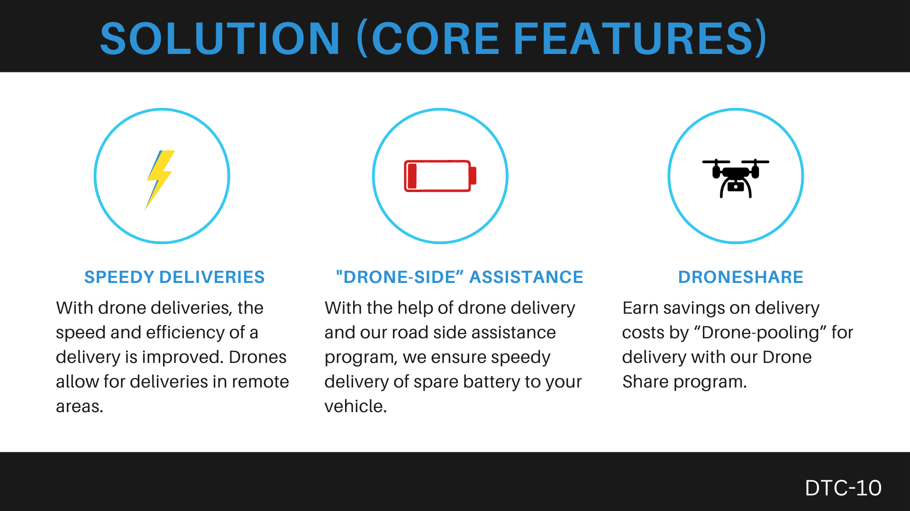

## About Us

**Team Name:**

DroneOn

**Team Members:**

- Candice Wei
- Spring Cheng
- Nolan Wai
- Melissa Shao
- Michael Lau

## Project Title

**Dronify**

## Project Description

**Dronify** is a web application that deploys autonomous drones (on-demand) to offer package delivery and roadside assistance for autonomous car owners during accidents, thereby reducing delivery time and traffic congestion.

## Technologies used

For the **front-end** we used:

* **Flowbite** as our UI library

For the **back-end** we used:
* **Mapbox API** for the map interface and the foundation for the visual interface
* **Turf.js** for routing display on the map
* **Geolocation API** for getting the user’s current location
* **Open Weather API** for our Easter egg
Cloudinary for populating user’s profile image

For the **database** we used:
* **MongoDB** for hosting our data collection (user’s personal information, user’s session, battery station geo-coordinates)

## File Contents
TBD

## How to Run Our Project
To get started with Dronify, the hosted version of the product can be used. You can get started immediately [here](https://dronify-mbme.onrender.com/). After the login page, you will be greeted with our three core features to select from.

### What to Install

**Language(s):**
* EJS
* JavaScript
* CSS

**IDEs:**
* Visual Studio Code

**Database(s):**
* MongoDB

**Other software:**
* Cloudinary

**Third Party APIs:**

| API        | Usage & Description        |
| ------------- |:-------------:|
| Mapbox API      | Map interface and the foundation for UI |
| Turf.js     | Routing display on the map     |
| Geolocation API | Getting the user's current location    |
| Open Weather API | Our Easter Egg component    |

### Required API Keys
* Mapbox Acess Token
* Open Weather API

### Additional Notes
Installation location and order does not matter for this project.

### Testing
Here is our [link](https://docs.google.com/spreadsheets/d/14Fitry6ACC5__D6XGdvO7034vG4NWeVpk5qbL6u0m30/edit?usp=sharing) to the testing done for this project, feel free to take a look and contribute to any bugfix!

## How It Works (Features)

## Credits, References, and Licenses
* City of Vancouver Open Data -
https://opendata.vancouver.ca/explore/dataset/electric-vehicle-charging-stations/api/

## AI Usage
**Project Support:**
* Our App Logo is generated using ChatGPT 3.5
* Although we did not use AI directly integrated in our app, we used it for code analysis - the old “explain this to me”
* We used it to minimize the risk of human error when working with long and possibly redundant lines of code (e.g. copy-and-paste fail)

**Data Sets:**
* Non-applicable, the only data set utilized in this project is is the geoJSON data set used to plot EV Battery Stations

**AI Integration:**
* Our app does not directly use AI

**Limitations Encountered:**
* Integration testing is hard for the current “free” models of AI to do well, when there are many components of the application coming together and working together in a somewhat delicate manner, it is hard for the current AI models to fully capture this well and provide accurate trouble-shooting

## Contact Information

You can reach us via GitHub profiles:

